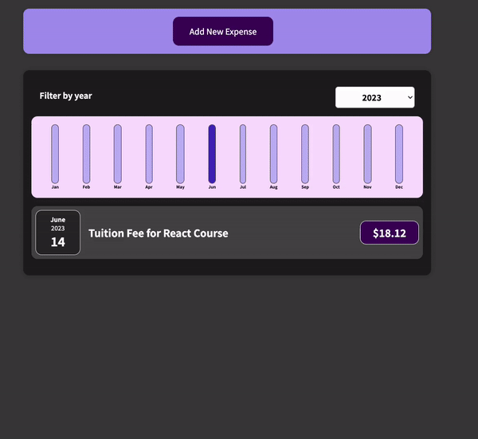

# Expense Tracker in React

## Description

This is a simple expense tracker app built with React. It allows a user to add and remove expenses and filter them by year.

There are various components in this app, including the Chart, Chart Bars, Expenses, Expense Filter, Expense Item, Expense List, Expense Form, New Expense, and New Expense Form components.

I used Reacts "useState" to manage the state of the various components and to make the app dynamic. I also used Reacts "props" to pass data between components (both up and down the component tree).

## Installation

To install this app, clone the repository and run `npm install` to install the dependencies. Then run `npm start` to start the app.

## Usage

To use this app, simply add an expense by clicking the "Add New Expense" button. You can then enter the expense title, amount, and date. You can then click the "Add Expense" button to add the expense to the list. You can also click the "Cancel" button to cancel adding the expense.

You can also filter the expenses by year by selecting a year from the dropdown menu.

## Demo:

